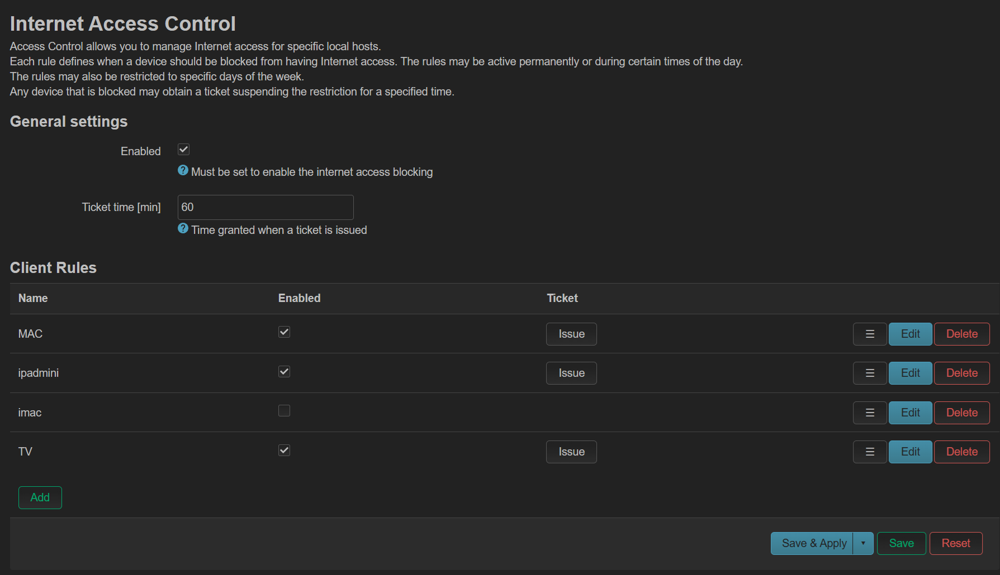

# Internet Access Control for OpenWrt

A fork of [k-szuster/luci-access-control](https://github.com/k-szuster/luci-access-control) with a **mobile-friendly UI redesign** and full support for the **OpenWrt 25.12+ APK** package format.

---

## Features

- Restrict internet access for specific LAN devices by MAC address
- Block permanently or on a time schedule (daily time range + day of week)
- **Temporary access ("Ticket")**: any blocked device can be granted temporary internet access with one click
- **Mobile-optimized UI**: the interface layout, buttons and interactions are redesigned to work comfortably on smartphone browsers
- Supports both modern **APK** (OpenWrt 25.12+) and legacy **IPK** (opkg) package formats

---

## Screenshot



---

## Install via APK (OpenWrt 25.12+)

### 1. Trust the repository signing key

```sh
wget -P /etc/apk/keys https://securecrt.github.io/luci-access-control/keys/securecrt.pem
```

### 2. Add the repository

```sh
echo "https://securecrt.github.io/luci-access-control/x86_64/action" >> /etc/apk/repositories
```

### 3. Install

```sh
apk update
apk add luci-app-access-control luci-i18n-access-control-zh-cn
```

> The post-install script automatically enables and starts the service.

---

## Install via IPK (legacy OpenWrt)

Download the `.ipk` file from [Releases](https://github.com/securecrt/luci-access-control/releases) and install:

```sh
opkg install luci-app-access-control_*.ipk
opkg install luci-i18n-access-control-zh-cn_*.ipk   # optional: Chinese UI
/etc/init.d/inetac enable
/etc/init.d/inetac start
```

---

## Build from Source

Copy `luci-app-access-control/` into your OpenWrt source tree:

```
<openwrt>/feeds/luci/applications/
```

Then run:

```sh
./scripts/feeds update luci
./scripts/feeds install -a luci
make menuconfig   # Select: LuCI -> Applications -> luci-app-access-control
make
```

---

## Changelog

| Version | Changes |
|---------|---------|
| v0.4.5 | Mobile-friendly UI redesign; OpenWrt 25.12 APK signed release |
| v0.4.4 | Fix firewall rule cleanup on package removal |
| v0.4.x | Add temporary access (Ticket) feature |

---

## Credits

- Original author: [k-szuster](https://github.com/k-szuster)
- Original repository: https://github.com/k-szuster/luci-access-control
